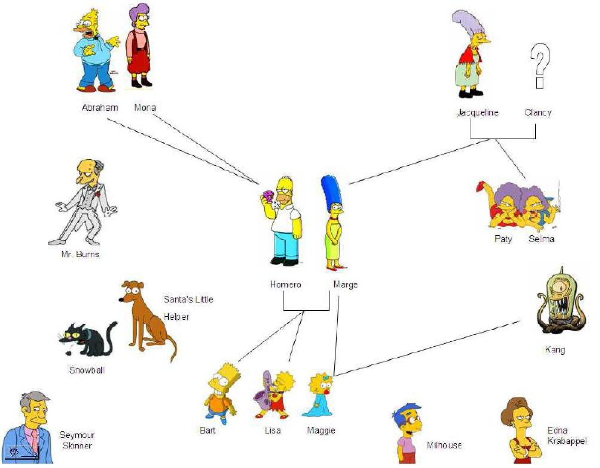
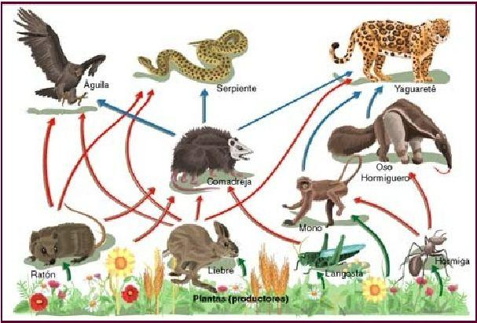

# Ejemplos de Prolog
## Tomando el grafico de la serie animada "Los Simpsons" represente las características de los objetos y las relaciones entre ellos. Asimismo, basadas en las relaciones "progenitor" y el género de las personas (hombre o mujer), establecer reglas para:

* abuelo(X,Y).
* abuela(X,Y).
* tio(X,Y).
* tia(X,Y).
* hermano(X,Y).
* hermana(X,Y).
* mediohermana(X,Y). cuñado(X,Y).
* cuñada(X,Y).

## Tomando el grafico siguiente represente las características de los objetos y las relaciones entre ellos. Asimismo establecer reglas para: quecome(X,Y).

## Realiza un programa que dado un signo del horóscopo nos muestre el día y mes de inicio y fin de ese signo.

* Virgo 21/8 al 21/9
* Aries 21/3 al 21/4
* Libra 21/9 al 21/10
* Tauro 21/4 al 21/5
* Escorpio 21/10 al 21/11
* Géminis 21/5 al 21/6
* Sagitario 21/11 al 21/12
* Cáncer 21/6 al 21/7
* Capricornio 21/12 al 21/1
* Leo 21/7 al 21/8
* Acuario 21/1 al 21/2

Escribir una regla que permita calcular el signo del Zodíaco para un día y un mes concreto, por ejemplo: signo(Dia,Mes,Signo)

## Escriba la(s) reglas(s) necesaria(s) para la función imprime

Ej. ?- imprime ([a,b,c,d]).

a

b

c

d

## Escriba la(s) regla(s) necesaria(s) para agregar un elemento al principio de una lista.

Ej. ?- agregar(gato,[zorro,gallina,cerdo],L).
L=[gato,zorro,gallina,cerdo]

## Escriba la(s) regla(s) necesaria(s) para agregar un elemento al final de una lista

Ej.?- agregar_final([agua, tierra, viento],fuego ,L).
L = [agua, tierra, viento, fuego]

## Clientes de compras en la librería. Sobre la base del conocimiento de productos indicando su descripción y precio:

* producto(cuaderno,30).
* producto(lapiz,10).
* producto(goma,8).
* producto(compaz,25).

Y las reglas que indican cada compra realizada por los clientes detallando el producto en su descripción y cantidad.

* compra(marta,producto(cuaderno,2)).
* compra(marta,producto(lapiz,1)).
* compra(jose,producto(compaz,1)).
* compra(jose,producto(goma,3)).

Se pide desarrollar haciendo uso de findall cláusulas de Horm que:

a. Se contabilice cuantos productos compro un cliente determinado.

b. Investiguen cuanto gasto un cliente.

c. Se detalle en una lista, las compras realizadas [(Cliente,Producto,Cantidad,Total), ..., (...)] en la libreria.

## Agencia de autos alta y baja gama

% Base del conocimiento
* auto(datos(baja,fiat,uno,2010,negro,precio(60000))).
* auto(datos(baja,renault,clio,2011,gris,precio(70000))).
* auto(datos(alta,volwagen,bora,2011,blanco,precio(160000))).
* auto(datos(alta,bmw,370,2011,blanco,precio(260000))).
* auto(datos(alta,mercedez,220,2012,gris,precio(280000))).

Desarrollar cláusulas que calculen

a. Importe total de autos por gama.

b. Lista de autos por gama.